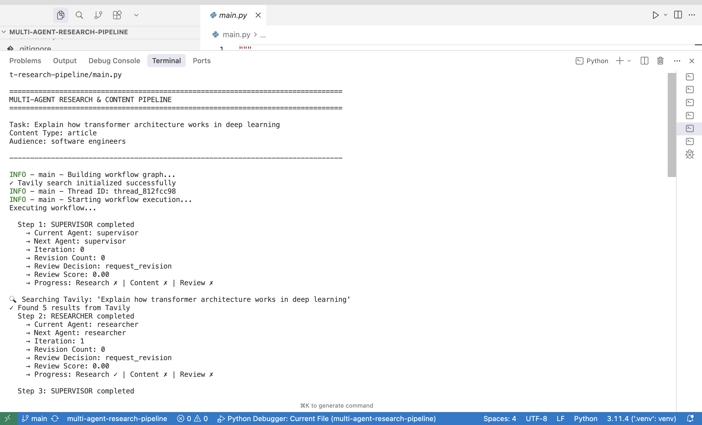
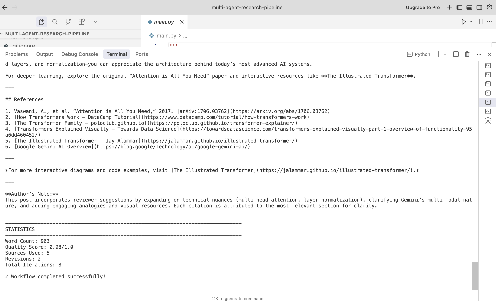

# 🤖 Multi-Agent AI Research & Content Pipeline

A production-grade autonomous multi-agent system built with **LangGraph** and **Azure OpenAI** that researches topics, generates high-quality content, and ensures accuracy through iterative review cycles.

[](https://www.python.org/downloads/)
[](https://github.com/langchain-ai/langgraph)
[](https://opensource.org/licenses/MIT)

---

## 🎯 Overview

This system demonstrates advanced **Agentic AI** patterns with four specialized agents working together autonomously:

- **🎯 Supervisor Agent**: Orchestrates workflow and routes tasks
- **🔍 Researcher Agent**: Searches web using Tavily API and validates sources
- **✍️ Content Creator Agent**: Generates professional content with citations
- **✅ Reviewer Agent**: Validates quality and provides iterative feedback

### **Key Features**

✅ **Real Web Search** - Integrated with Tavily API for live research  
✅ **Multi-Agent Orchestration** - Autonomous task routing with LangGraph  
✅ **Quality Control** - Iterative feedback loops ensure 0.90+ quality scores  
✅ **Production Ready** - Rate limiting, error handling, checkpointing, logging  
✅ **Type Safe** - Pydantic models with validation  
✅ **Extensible** - Easy to add new agents or tools

---

## 🏗️ Architecture
```
┌─────────────────────────────────────────────────────┐
│                    USER REQUEST                      │
│         "Research quantum computing trends"          │
└────────────────────┬────────────────────────────────┘
                     │
                     ▼
            ┌─────────────────┐
            │   SUPERVISOR    │◄──────┐
            │     AGENT       │       │
            └────────┬────────┘       │
                     │                │
        ┌────────────┼────────────────┼──────────┐
        │            │                │          │
        ▼            ▼                ▼          │
   ┌─────────┐ ┌──────────┐   ┌──────────┐       │
   │RESEARCH │ │ CONTENT  │   │ REVIEWER │       │
   │  AGENT  │ │ CREATOR  │   │  AGENT   │       │
   │         │ │  AGENT   │   │          │       │
   │• Tavily │ │• Generate│   │• Validate│       │
   │  Search │ │  Content │   │• Score   │       │
   │• Extract│ │•Citations│   │• Feedback│       │
   └────┬────┘ └─────┬────┘   └─────┬────┘       │
        │            │              │            │
        └────────────┴──────────────┴────────────┘
                     │
                     ▼
            ┌─────────────────┐
            │  FINAL OUTPUT   │
            └─────────────────┘
```

---

## 🚀 Quick Start

### **Prerequisites**

- Python 3.10+
- Azure OpenAI account with API access
- Tavily API key (free tier: 1000 searches/month)

### **Installation**
```bash
# Clone repository
git clone https://github.com/harshv2013/multi-agent-research-pipeline
cd multi-agent-research-pipeline

# Create virtual environment
python -m venv .venv
source .venv/bin/activate  # On Windows: .venv\Scripts\activate

# Install dependencies
pip install -r requirements.txt
```

### **Configuration**

Create `.env` file in project root:
```env
# Azure OpenAI
AZURE_OPENAI_ENDPOINT=https://your-resource.openai.azure.com/
AZURE_OPENAI_API_KEY=your-api-key-here
AZURE_OPENAI_DEPLOYMENT_NAME=gpt-4

# Tavily Search
TAVILY_API_KEY=tvly-your-key-here

# Model Configuration
LLM_TEMPERATURE=0.7
LLM_MAX_TOKENS=4000

# Agent Configuration
MAX_ITERATIONS=15
```

### **Run**
```bash
# Basic usage
python main.py "Research quantum computing applications"

# With options
python main.py "Explain microservices architecture" \
  --content-type article \
  --audience "software engineers" \
  --verbose

# Save output
python main.py "AI ethics overview" --save-output output.txt
```

---

## 📊 Example Output

**Input:**
```bash
python main.py "Explain how transformer architecture works in deep learning"
```

**Output:**
```
================================================================================
MULTI-AGENT RESEARCH & CONTENT PIPELINE
================================================================================

Task: Explain how transformer architecture works in deep learning
Content Type: article
Audience: software engineers

✓ Tavily search initialized successfully
🔍 Searching Tavily: 'transformer architecture deep learning'
✓ Found 5 results from Tavily

Executing workflow...
  Step 1: SUPERVISOR completed
  Step 2: RESEARCHER completed
  Step 3: CONTENT_CREATOR completed
  Step 4: REVIEWER completed

================================================================================
RESULTS
================================================================================

[Generated professional article with citations and proper structure]

--------------------------------------------------------------------------------
STATISTICS
--------------------------------------------------------------------------------
Word Count: 1,245
Quality Score: 0.93/1.0
Sources Used: 5
Revisions: 1
Total Iterations: 7

✓ Workflow completed successfully!
```



---

## 🛠️ Project Structure
```
multi-agent-research-pipeline/
├── config/                 # Configuration management
│   ├── settings.py         # Pydantic settings with Azure OpenAI
│   └── prompts.py          # Agent system prompts
├── agents/                 # Agent implementations
│   ├── base_agent.py       # Base class with LLM integration
│   ├── supervisor.py       # Orchestrator agent
│   ├── researcher.py       # Research agent with Tavily
│   ├── content_creator.py  # Content generation
│   └── reviewer.py         # Quality control
├── tools/                  # Agent tools
│   ├── web_search.py       # Tavily search integration
│   ├── data_extraction.py  # Text analysis & extraction
│   └── validation.py       # Content validation
├── state/                  # State management
│   ├── schemas.py          # TypedDict state definitions
│   └── memory.py           # Conversation memory
├── workflows/              # LangGraph workflows
│   ├── graph_builder.py    # Workflow construction
│   └── checkpointer.py     # State persistence
├── utils/                  # Utilities
│   ├── logger.py           # Structured logging
│   ├── rate_limiter.py     # API rate limiting
│   └── visualizer.py       # Workflow visualization
├── examples/               # Usage examples
├── tests/                  # Unit tests
├── main.py                 # Entry point
├── requirements.txt        # Dependencies
└── .env.example           # Environment template
```

---

## 🎓 Key Concepts Demonstrated

### **Multi-Agent Patterns**
- ✅ Supervisor pattern for orchestration
- ✅ Specialized agents with clear responsibilities
- ✅ Inter-agent communication via state
- ✅ Conditional routing based on context

### **LangGraph Features**
- ✅ StateGraph for workflow management
- ✅ Conditional edges for dynamic routing
- ✅ Checkpointing for state persistence
- ✅ TypedDict with reducers for state

### **Production Patterns**
- ✅ Rate limiting with token bucket algorithm
- ✅ Error handling and retry logic
- ✅ Structured logging with context
- ✅ Type safety with Pydantic

### **Azure OpenAI Integration**
- ✅ Function calling for tool use
- ✅ Streaming responses
- ✅ Token optimization
- ✅ Cost management

---

## 🔧 Customization

### **Change Search Provider**

Currently uses Tavily. To switch providers, modify `tools/web_search.py`:
```python
# Easy to swap: Tavily → Serper, Brave, DuckDuckGo
```

### **Add New Agent**

1. Create agent in `agents/your_agent.py`
2. Inherit from `BaseAgent`
3. Implement `execute()` method
4. Add to workflow in `workflows/graph_builder.py`

### **Modify Content Types**

Edit `config/prompts.py` to change:
- Agent instructions
- Output formats
- Quality criteria

---

## 📈 Performance Metrics

**Typical Execution:**
- **Iterations**: 5-7 steps
- **API Calls**: 8-12 requests
- **Quality Score**: 0.90-0.95
- **Execution Time**: 45-90 seconds
- **Token Usage**: 8K-15K tokens

**Optimization Features:**
- Caching reduces redundant searches
- Rate limiting prevents quota exhaustion
- Early approval for high-quality content
- Checkpointing enables resumption

---

## 🧪 Testing
```bash
# Run all tests
pytest

# Run with coverage
pytest --cov=. --cov-report=html

# Run specific test
pytest tests/test_agents.py -v
```

---

## 🐛 Debugging in VS Code

### **Setup**

Create `.vscode/launch.json`:
```json
{
    "version": "0.2.0",
    "configurations": [
        {
            "name": "Debug Multi-Agent",
            "type": "debugpy",
            "request": "launch",
            "program": "${workspaceFolder}/main.py",
            "console": "integratedTerminal",
            "justMyCode": true
        }
    ]
}
```

### **Hardcode Debug Query**

Edit `main.py` to set debug values:
```python
class DebugArgs:
    task = "Your test query here"
    content_type = "article"
    verbose = True
```

Press **F5** to debug!

---

## 🔍 Common Issues

### **Issue: Tavily API Error**
```
Solution: Verify TAVILY_API_KEY in .env file
Free tier: 1000 searches/month at tavily.com
```

### **Issue: Azure OpenAI Authentication**
```
Solution: Check AZURE_OPENAI_ENDPOINT and AZURE_OPENAI_API_KEY
Ensure deployment name matches your Azure resource
```

### **Issue: Low Quality Scores**
```
Solution: Adjust weights in agents/reviewer.py _combine_reviews()
Increase LLM weight: (overall_score * 0.7 + validation * 0.3)
```

---

## 🤝 Contributing

Contributions welcome! Please:

1. Fork the repository
2. Create feature branch (`git checkout -b feature/amazing`)
3. Commit changes (`git commit -m 'Add amazing feature'`)
4. Push to branch (`git push origin feature/amazing`)
5. Open Pull Request

---

## 📝 License

This project is licensed under the MIT License - see [LICENSE](LICENSE) file for details.

---

## 🙏 Acknowledgments

- **LangChain/LangGraph** - Agent orchestration framework
- **Tavily** - AI-optimized search API
- **Azure OpenAI** - LLM infrastructure
- **Pydantic** - Data validation

---

## 📧 Contact

**Harsh Vardhan** - harsh2013@gmail.com

**Linkedin** https://www.linkedin.com/in/harsh-vardhan-60b6aa106/

**Project Link**: [https://github.com/harshv2013/multi-agent-research-pipeline](https://github.com/harshv2013/multi-agent-research-pipeline)

**Built with ❤️ using LangGraph, Azure OpenAI, and Python**